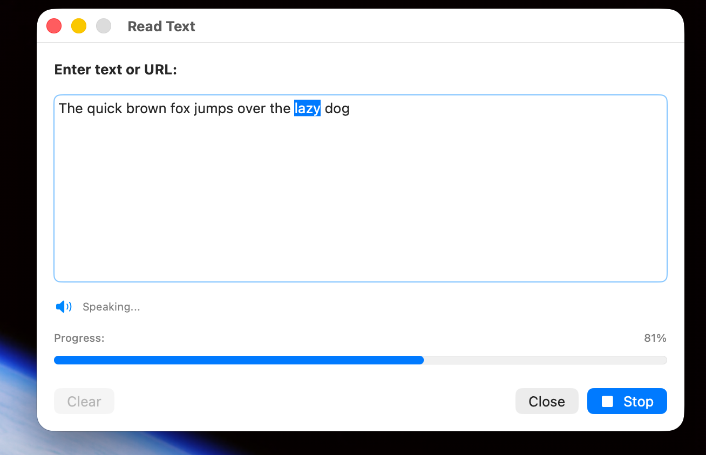
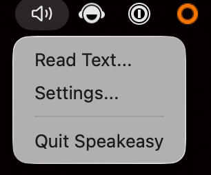
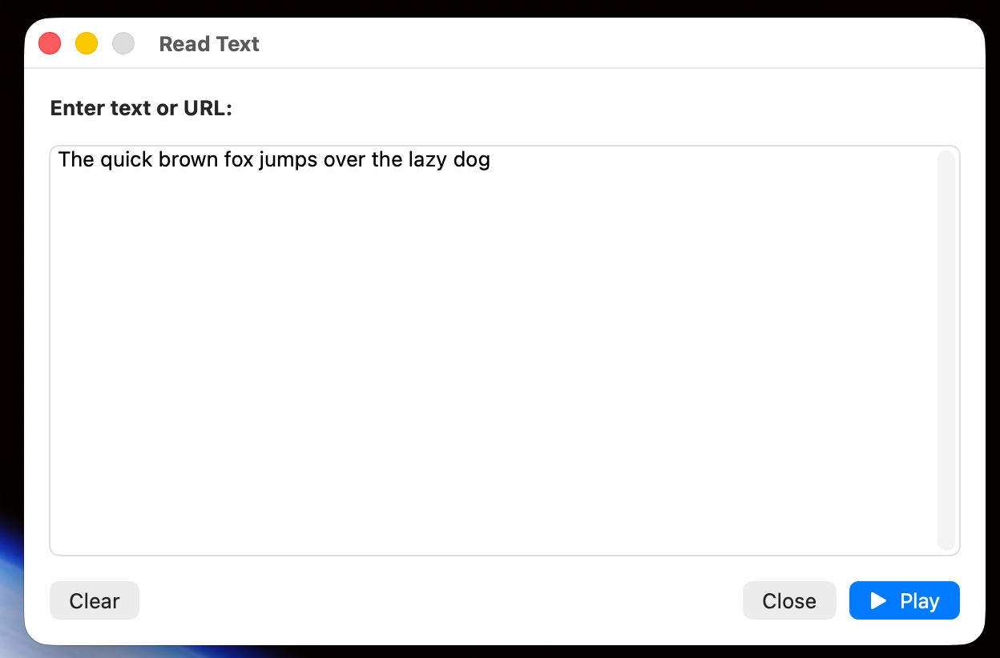
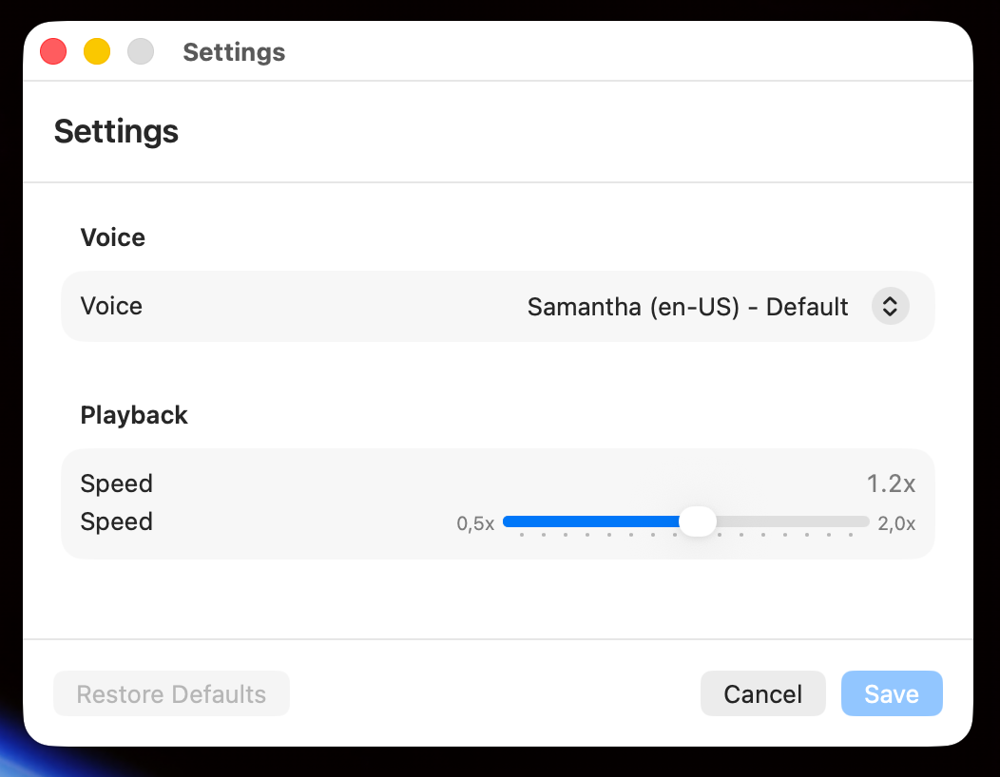

# Speakeasy

Native macOS menu bar application for reading text and URLs aloud using Apple's native text-to-speech.



## Features

- Native macOS text-to-speech using AVSpeechSynthesizer
- Menu bar interface with SwiftUI
- URL content extraction with HTML parsing
- Customizable voice and playback speed
- Real-time playback progress with word highlighting
- Playback controls: play/stop (input window), pause/resume/stop (menu bar)
- Structured logging using OSLog

## Requirements

- macOS 14.0+
- Xcode 15.0+ (for development)
- Swift 5.9+
- Accessibility permissions (optional, only required for global keyboard shortcuts)

## Installation

> **Note:** This app is not code-signed (no Apple Developer ID). On first launch, macOS Gatekeeper will show a security warning. To bypass: **right-click the app → Open**. You only need to do this once.

### Option 1: Download Release Build

1. Download the latest release from the Releases page
2. Drag `Speakeasy.app` to your Applications folder
3. **First launch:** Right-click → Open (to bypass Gatekeeper)
4. Launch normally from Applications or Spotlight

### Option 2: Build from Source

```bash
# Clone the repository
git clone https://github.com/minac/speakeasy-mac.git
cd speakeasy-mac

# Build and create app bundle
./create-app-bundle.sh release

# Install to Applications
cp -r build/release/Speakeasy.app /Applications/
```

## Usage

1. Click the speaker icon in the menu bar
2. Select "Read Text..."



3. Enter text or paste a URL
4. Click "Play" to start playback (button changes to "Stop")



### Playback Controls

- **Input Window**: Play/Stop toggle button
- **Menu Bar**: Pause, Resume, and Stop buttons appear during playback with progress indicator

### Settings

- **Voice**: Choose from available macOS system voices
- **Speed**: Adjust playback speed (0.5x - 2.0x)



### Getting Better Voices

For more natural-sounding free voices for macOS:

1. Open **System Settings > Accessibility > Spoken Content**
2. Click **System Voice > Manage Voices...**
3. Download **Enhanced** or **Premium** versions

## Development

### Building

```bash
# Debug build (for development)
./create-app-bundle.sh debug
open build/debug/Speakeasy-build.app
```

### Running Tests

```bash
swift test --package-path Speakeasy
```

Or in Xcode: **Cmd+U**

### Project Structure

```
Speakeasy/
├── Speakeasy/
│   ├── SpeakeasyApp.swift              # App entry point
│   ├── Core/
│   │   ├── AppState.swift              # Central state management
│   │   ├── SpeechEngine.swift          # TTS engine wrapper
│   │   ├── TextExtractor.swift         # URL/HTML processing
│   │   └── ShortcutManager.swift       # Global keyboard shortcuts
│   ├── Models/
│   │   ├── SpeechSettings.swift        # Settings model
│   │   ├── Voice.swift                 # Voice wrapper
│   │   └── PlaybackState.swift         # Playback states
│   ├── Services/
│   │   ├── SettingsService.swift       # UserDefaults persistence
│   │   └── VoiceDiscoveryService.swift # System voice enumeration
│   ├── Utilities/
│   │   ├── Logger.swift                # OSLog structured logging
│   │   ├── PermissionsManager.swift    # Accessibility permissions
│   │   └── Extensions.swift            # String extensions
│   ├── Views/
│   │   ├── MenuBarView.swift           # Menu bar interface
│   │   ├── InputWindow.swift           # Text input window
│   │   ├── SettingsWindow.swift        # Settings interface
│   │   └── Components/
│   │       ├── VoicePicker.swift
│   │       ├── SpeedSlider.swift
│   │       └── HighlightedTextView.swift
│   ├── ViewModels/
│   │   ├── InputViewModel.swift
│   │   └── SettingsViewModel.swift
│   └── Resources/
│       └── Info.plist
└── Tests/
    ├── CoreTests/
    ├── ServicesTests/
    └── ViewModelTests/
```

## Dependencies

- [SwiftSoup](https://github.com/scinfu/SwiftSoup) - HTML parsing

## Build System

The project uses Swift Package Manager with a custom build script to create proper macOS `.app` bundles.

**Why the custom script?**

Swift Package Manager executables don't generate proper `.app` bundles with `Info.plist` by default. The `create-app-bundle.sh` script:

1. Builds the executable with `swift build`
2. Creates proper `.app` bundle structure
3. Copies `Info.plist` with bundle identifier
4. Sets correct permissions

## Troubleshooting

### Text input not working

Make sure you're running the app as a proper `.app` bundle (not via `swift run`), as terminal-launched apps capture keyboard input.

## Contributing

1. Fork the repository
2. Create a feature branch (`git checkout -b feature/amazing-feature`)
3. Write tests first (TDD)
4. Implement feature
5. Run tests (`swift test`)
6. Commit your changes
7. Push to the branch
8. Open a Pull Request

## License

MIT

## Acknowledgments

- Built with Claude Code
